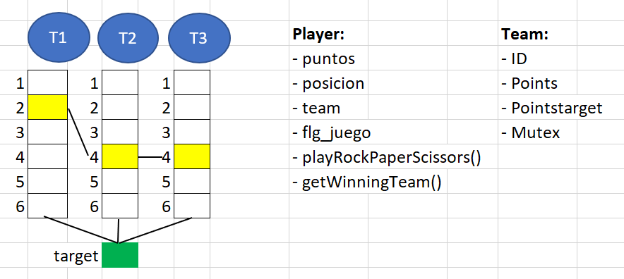

# Trabajo Programacion Concurrente : Hoop Hula Hop Rock Paper Scissors
Link video: [https://youtu.be/3WEhMVLoHco]
## *Contexto*
El juego describe un grupo de niños dentro de una area seleccionada con hula hulas, en donde se crean distintos grupos con N cantidades de niños, ellos pueden avanzar continuamente hasta el grupo contraria exceptuando que cuando uno de estos se encuentren con otro equipo tendran que realizar el juego de piedra papel y tijeras, en donde el ganador podra continuar y el perdedor regresara, el ganador tambien ganara 1 punto para su equipo. En este caso los el equipo que consiga Puntos Totales x 1.50, obtendra la victoria del juego.

## Diseño de Logica
**Estructura Player:**  Para poder tenerlos como un objeto o instancia a cada jugador y saber su posicion y grupo perteneciente se le han asigando estos parametros.
El jugador contiene la siguiente estructura:
- ID: identificador del jugador
- Team: Identificador del equipo al que pertenece el jugador
- Pòsition: Posición actual del jugador
- Points: Puntos obtenidos por el jugador
- Meta: Booleano que indica haber llegada a una posicion segura
- Mutex: Exclusión mutua para avanzar la posición del jugador  

**Estructura Team:** Se utiliza para agrupar a N cantidad de players (niños), en donde tambien estos tienen un numero de puntos consigo.
La estructura del Team contiene :
 - ID: identificador de Team
 - Points: Puntos iniciales del Team
 - Points Target: Puntos ha alcanzar para conseguir la victoria

## Diseño Funciones Generales
**Get Opponent()** busca en la lista de jugadores un oponente para el jugador dado, asegurándose de que pertenezcan a equipos diferentes y tengan la misma posición.  

**PlayRockPaperScissors()** la función playRockPaperScissors simula una partida de "piedra, papel o tijeras" entre dos jugadores. Actualiza sus posiciones y puntajes según el resultado del juego.  

**getWinningTeam ()**  recorre la lista de equipos y verifica cuál de ellos ha alcanzado el objetivo de puntos para determinar el equipo ganador del juego.

Se agregó el componente de programación distribuida, este consiste en una arquitectura circular y comunicación a través de formato json. Cada nodo tiene dos puertos: input, output. El nodo recibe los datos a través del puerto input, luego los almacena y los envía al puerto output. Para este fin se agregaron las siguientes funciones:  

**manejador()**: Esta función se encarga de procesar los datos que lleguen por el puerto input. Se maneja un parámetro contador, el cuál si llega al número 3, entonces, inicia el proceso de juego en ese nodo.

**recibir()**: Se encarga del leer y preprocesar el dato (como eliminar espacios). 

**enviarTeam()**: Se encarga de realizar la llamada hacia el puerto output y enviar los datos correspondientes.

Los datos que se envian a través de los nodos:

**Lista de Players**: Conjunto de niños en el juego.

**Lista de Team**: Descripción de los equipos del juego.

## Diagrama ilustrativo
Diagrama 1: Diagrama de juego

Diagrama 2: Diagrama estrella del sistema distribuido

